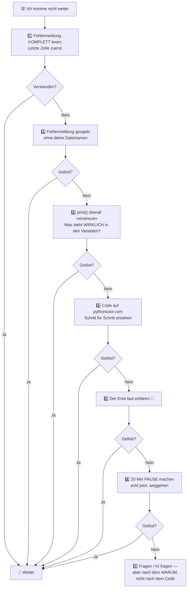

# 🧠 Wie du wirklich lernst

> **Lesezeit: 12 Minuten. Ersparnis: geschätzt 50 Stunden.**
> Das ist das wichtigste Dokument im ganzen Repo. Kein Witz.

---

## 😤 Die unbequeme Wahrheit vorweg

Fast alle Anfänger lernen so:

```text
Video schauen 📺 → nicken 👍 → „verstanden!" ✅ → nächstes Video 📺
```

Drei Wochen später sitzen sie vor einer leeren Datei und wissen nicht, wie man eine Schleife schreibt. Sie denken, sie sind zu dumm. **Sie sind nicht zu dumm. Ihre Methode war kaputt.**

Der Fehler heißt **„Illusion der Kompetenz"**: Wenn dir jemand etwas erklärt, fühlt sich das flüssig und einleuchtend an. Dieses Gefühl von Leichtigkeit verwechselt dein Gehirn mit Können. Aber Erkennen („ah ja, klar!") und Abrufen („mach das mal ohne Hilfe") sind zwei völlig verschiedene Fähigkeiten.

> 🎓 **Merksatz:** Wiedererkennen ≠ Können. Nur das, was du **ohne Vorlage** produzieren kannst, kannst du wirklich.

---

## 🔬 Die 6 Prinzipien, die nachweislich funktionieren

Die Lernforschung ist sich hier ungewöhnlich einig. Eine große Übersichtsarbeit über 240+ Studien fand: Die mit Abstand wirksamsten Techniken sind **verteiltes Üben** (spaced practice) und **Abrufübungen** (practice testing). Genau darauf ist dieser Kurs gebaut.

---

### 1️⃣ Retrieval Practice — Wissen herausholen statt reinstopfen

**Was:** Aktiv aus dem Gedächtnis abrufen, statt nochmal nachzulesen.

**Warum es wirkt:** Jedes Mal, wenn du eine Erinnerung mit Anstrengung hervorholst, wird die Verbindung im Gehirn stärker. Nochmal lesen fühlt sich produktiver an, ist aber weit schwächer. Der Abruf **ist** das Lernen — nicht die Vorbereitung darauf.

**Im Kurs:** Jedes Modul endet mit einem 🧠 **Selbsttest**. Beantworte die Fragen **zugeklappt**, auf Papier oder laut. Erst danach nachschauen.

**Für dich konkret:**

```text
❌ Modul nochmal durchlesen
✅ Laptop zuklappen, Blatt Papier: „Was war in Modul 04? Schreib alles auf."
   Dann vergleichen. Die Lücken sind dein Lernplan für morgen.
```

> 💡 Das fühlt sich anstrengend und unangenehm an. **Genau das ist das Signal, dass es wirkt.** Man nennt das *desirable difficulty* — wünschenswerte Schwierigkeit.

---

### 2️⃣ Spaced Repetition — Verteilen statt Bulimielernen

**Was:** Dieselben Inhalte über Tage/Wochen verteilt wiederholen, statt alles auf einmal.

**Warum es wirkt:** Vergessen ist kein Bug, sondern ein Feature. Wenn du kurz vor dem Vergessen wieder abrufst, speichert dein Gehirn viel dauerhafter. 5 Stunden über 5 Tage schlagen 5 Stunden an einem Tag — deutlich.

**Im Kurs:** Jedes Modul hat einen 🔄 **Wiederholungs-Block**, der gezielt Stoff von vor 1 Woche und vor 1 Monat abfragt. Nicht überspringen.

**Dein Wiederholungs-Rhythmus:**

| Wann | Was |
|---|---|
| 📅 Jeden Tag (5 Min) | Selbsttest von **gestern** — aus dem Kopf |
| 📅 Jeden Freitag (20 Min) | 2 Aufgaben aus dieser Woche, **komplett neu tippen**, ohne Lösung |
| 📅 Jeden Monatsanfang (45 Min) | „Boss-Runde": je 1 Aufgabe aus den letzten 4 Modulen |

---

### 3️⃣ Interleaving — Themen mischen

**Was:** Nicht 30 Schleifen-Aufgaben am Stück, sondern Schleifen + Listen + Strings gemischt.

**Warum es wirkt:** Beim Block-Üben lernst du das *Muster der Übung*, nicht das *Konzept*. Gemischt musst du jedes Mal neu entscheiden: „Welches Werkzeug brauche ich hier?" — und genau diese Entscheidung ist die eigentliche Fähigkeit beim Programmieren.

**Im Kurs:** Ab Modul 06 enthalten die Aufgabenblätter bewusst **Mix-Aufgaben** 🥗, die alte Themen mit neuen kombinieren.

---

### 4️⃣ Elaboration & Feynman — Erkläre es einem Kind

**Was:** Neues Wissen mit eigenen Worten und eigenen Beispielen verknüpfen.

**Die Feynman-Technik in 4 Schritten:**

```text
1. 📝 Schreib den Begriff oben auf ein leeres Blatt.
2. 🗣️ Erkläre ihn so, dass ein 12-Jähriger ihn versteht. Ohne Fachwörter.
3. 🕳️ Wo du ins Stocken gerätst → da ist deine Wissenslücke. Markieren.
4. 📚 Nur diese Lücke nachschlagen. Zurück zu Schritt 2.
```

**Im Kurs:** Jedes Modul hat mindestens eine ✍️ *Erklär-Aufgabe*. Die fühlt sich „unnötig" an. Sie ist es nicht.

> 🦆 **Rubber Duck Debugging:** Erklär deinen kaputten Code laut einer Gummiente. Klingt albern, funktioniert absurd gut — beim Erklären merkst du selbst, wo der Denkfehler steckt. Profis machen das täglich.

---

### 5️⃣ Konkrete Beispiele + Dual Coding

**Was:** Abstraktes immer an mindestens 2 konkreten Beispielen festmachen — und zusätzlich visualisieren.

**Warum es wirkt:** Abstrakte Regeln allein haften nicht. Zwei unterschiedliche Beispiele zeigen dem Gehirn, was das Gemeinsame ist — das ist der eigentliche Begriff.

**Im Kurs:** Jedes Konzept kommt mit einem 🏠 *Alltagsbild* (was ist eine Variable? ein beschrifteter Karton) und einem 🌍 *Realbeispiel* (wo brauchst du das im echten Leben?).

**Dein bestes Werkzeug hierfür:** 👉 **[pythontutor.com](https://pythontutor.com/visualize.html)** — fügst du Code ein, siehst du Schritt für Schritt, was im Speicher passiert. Bei „ich versteh nicht warum" ist das die erste Anlaufstelle.

---

### 6️⃣ Deliberate Practice — Gezielt an der Kante üben

**Was:** Nicht üben, was du schon kannst. Üben, was gerade **knapp zu schwer** ist.

**Die Zone:**

```text
😴 Zu leicht      →  Langeweile, kein Lerneffekt
🎯 Knapp zu schwer →  HIER passiert Lernen ("Flow-Zone")
😱 Viel zu schwer  →  Frust, Aufgeben
```

**Im Kurs:** Aufgaben sind mit Schwierigkeit markiert:
🟢 Grundlagen · 🟡 Anwenden · 🔴 Transfer (echtes Nachdenken) · ⭐ Bonus (Kopfnuss)

**Faustregel:** Wenn du **alle** 🟢 sofort löst → geh schneller. Wenn du bei 🟡 dauerhaft feststeckst → geh ein Modul zurück.

---

## 🚫 Die 5 Zeitfresser (was NICHT funktioniert)

| ❌ Beliebt, aber schwach | ✅ Mach stattdessen |
|---|---|
| Tutorials im Dauerkonsum („Tutorial Hell") 📺 | Nach **jedem** Video: Laptop zu, Gelerntes selbst nachbauen |
| Markieren & Unterstreichen 🖍️ | Aus dem Kopf zusammenfassen |
| Code kopieren & einfügen 📋 | Abtippen — jeden Buchstaben |
| Nochmal lesen 🔁 | Selbsttest ohne Vorlage |
| Notizen abschreiben ✍️ | Notizen aus dem Gedächtnis rekonstruieren |

> 🚨 **Warnsignal Tutorial Hell:** Du schaust seit Wochen Inhalte, fühlst dich schlau, kannst aber ohne Vorlage nichts bauen. Ausweg: **Sofort ein winziges eigenes Projekt starten.** Es darf hässlich sein. Es muss nur deins sein.

---

## 📅 Deine perfekte Lernstunde (60 Min)

```text
┌──────────────────────────────────────────────────────────────┐
│  🔄  0–5 Min    AUFWÄRMEN                                     │
│                 Selbsttest von gestern — aus dem Kopf.        │
│                 Nicht nachschauen! Nur ankreuzen was sitzt.   │
├──────────────────────────────────────────────────────────────┤
│  📖  5–20 Min   NEUES LERNEN                                  │
│                 README-Abschnitt lesen.                       │
│                 Jedes Beispiel ABTIPPEN und ausführen.        │
├──────────────────────────────────────────────────────────────┤
│  ⌨️  20–50 Min  ÜBEN  ← DAS IST DER WICHTIGSTE TEIL          │
│                 Aufgaben lösen. Bei Fehlern:                  │
│                 erst 15 Min selbst kämpfen, dann Lösung.      │
├──────────────────────────────────────────────────────────────┤
│  ✍️  50–60 Min  FESTIGEN                                      │
│                 Lernjournal: 3 Sätze.                         │
│                 „Heute gelernt: … / Hängen geblieben bei: …"  │
└──────────────────────────────────────────────────────────────┘
```

⏱️ **Nur 25 Minuten Zeit?** Dann: 5 Min Aufwärmen + 20 Min Üben. **Übung schlägt Theorie, immer.**

---

## 📓 Dein Lernjournal

Leg dir eine Datei `MEIN_JOURNAL.md` an (oder ein Notizbuch). Jeden Tag drei Zeilen:

```markdown
## 2026-08-03 · Modul 04 · 55 Min
- ✅ Gelernt: elif prüft nur, wenn das if davor False war
- 🤔 Unklar: Warum ist `if liste:` dasselbe wie `if len(liste) > 0:`?
- 💪 Stolz auf: Aufgabe 5 ohne Lösung geschafft!
```

**Warum das so stark ist:**
- Die „Unklar"-Zeile wird zu deiner To-do-Liste für morgen 🎯
- Nach 3 Monaten zurückblättern = massiver Motivationsschub 📈
- Das Aufschreiben selbst ist bereits Retrieval Practice 🧠

---

## 😰 Wenn du feststeckst — der Notfallplan

Feststecken ist **kein Zeichen von Unfähigkeit**, es ist der Normalzustand beim Programmieren. Profis stecken täglich fest. Sie haben nur ein besseres Verfahren:



> ⏰ **15-Minuten-Regel:** Kämpfe mindestens 15 Minuten allein. Aber nach **45 Minuten ohne jeden Fortschritt** ist weiterkämpfen keine Tugend mehr, sondern Zeitverschwendung. Dann: Lösung ansehen, **verstehen**, Datei schließen, **aus dem Kopf neu tippen**. Dieser letzte Schritt ist der entscheidende.

---

## 🤖 KI richtig als Tutor nutzen

Du wirst ChatGPT/Claude benutzen. Das ist okay — wenn du es als **Tutor** und nicht als **Ghostwriter** nutzt. Sonst lernst du null.

| ❌ Macht dich abhängig | ✅ Macht dich besser |
|---|---|
| „Schreib mir ein Programm, das X macht" | „Hier ist mein Versuch. Warum kommt Fehler Y?" |
| „Löse Aufgabe 3" | „Gib mir einen **Hinweis** zu Aufgabe 3, nicht die Lösung" |
| Antwort kopieren, weiter | „Erklär mir Zeile 4, als wäre ich Anfänger" |
| — | „Ich glaube, `for` funktioniert so: … Stimmt das?" |

> 🔒 **Eiserne Regel:** In den ersten 11 Modulen **niemals** Code von einer KI kopieren. Erklärungen: gern. Code: selbst tippen. Sonst baust du ein Kartenhaus.

---

## 🎢 Die Motivations-Kurve (du bist nicht allein)

```text
Motivation
   ▲
   │ 😍                                              🚀
   │  ╲                                            ╱
   │   ╲                                        ╱
   │    ╲          "Ich kann das nicht"      ╱
   │     ╲___                    ___╱
   │         ╲___ 😩 ______ 😐 ╱
   │              TAL DES TODES
   └──────────────────────────────────────────────▶  Zeit
     Woche 1      Woche 4-8       Woche 12     Woche 20+
```

**Woche 4–8 wird hart.** Das ist keine Warnung, das ist eine Vorhersage. Der Anfangsreiz ist weg, aber du kannst noch nichts Beeindruckendes bauen. Da steigen die meisten aus.

**Wie du durchkommst:**

- 🎯 Ziel runterschrauben, nicht aufgeben. 10 Minuten sind besser als 0.
- 🛠️ Bau etwas Dummes, das dir Spaß macht (ein Programm, das dich beleidigt, wenn du falsch rätst 😄).
- 📓 Journal von Woche 1 lesen. „Was, DAS war mal schwer für mich?"
- 👥 Erzähl jemandem davon. Öffentliche Zusagen halten besser.
- 🧱 Denk dran: du legst gerade das Fundament. Fundamente sehen nie beeindruckend aus. Häuser ohne Fundament fallen um.

---

## ✅ Die Kurzfassung auf einer Karte

```text
╔═══════════════════════════════════════════════════════════╗
║  🧠  MEINE 8 LERNREGELN                                    ║
╠═══════════════════════════════════════════════════════════╣
║  1. Abrufen statt nachlesen        (Selbsttest zuklappen)  ║
║  2. Täglich statt am Stück         (25 Min > 3 h sonntags) ║
║  3. Themen mischen                 (Mix-Aufgaben machen)   ║
║  4. Laut erklären                  (Feynman + 🦆)          ║
║  5. Immer 2 konkrete Beispiele     (+ pythontutor.com)     ║
║  6. Am Rand des Könnens üben       (🟡 und 🔴, nicht 🟢)   ║
║  7. Abtippen, nie kopieren         (Finger lernen mit)     ║
║  8. Journal führen                 (3 Zeilen pro Tag)      ║
╚═══════════════════════════════════════════════════════════╝
```

---

📌 **Komm alle 4 Wochen hierher zurück.** Beim zweiten Lesen wirst du Sachen sehen, die du beim ersten Mal überlesen hast — weil du dann Erfahrung hast, an die sie andocken können.

**→ Weiter zu [SETUP.md](SETUP.md)** 🔧
