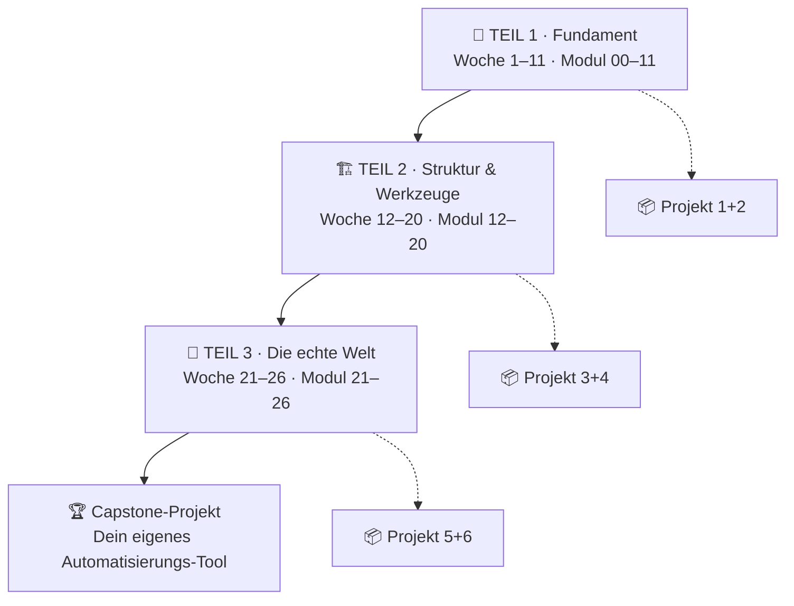

<div align="center">

# 🐍 Python von 0 auf 100

### Dein persönlicher Python-Kurs — vom allerersten `print()` bis zum echten Automatisierungs-Projekt

**26 Wochen · 1 Stunde pro Tag · 27 Module · 6 Praxisprojekte · 200+ Aufgaben**


</div>

---

## 👋 Hallo!

Dieses Repo ist kein Buch, das du liest. Es ist ein **Trainingsplan**.

Stell dir vor, du willst Klavier lernen. Du könntest 300 Seiten über Musiktheorie lesen — und danach immer noch keinen einzigen Ton spielen können. Oder du setzt dich täglich 30 Minuten ans Klavier und spielst.

Programmieren ist genauso. **Du lernst Python nicht durch Lesen. Du lernst es durch Tippen.**

Deshalb ist dieser Kurs so gebaut:

> 📖 **20 % lesen** → 💡 **20 % Beispiele nachvollziehen** → ⌨️ **60 % selbst tippen**

Wenn du dich am Ende des Tages fragst *„Habe ich heute Code geschrieben?"* und die Antwort ist **nein** — dann war der Tag nicht optimal genutzt. Kein Drama. Aber merk es dir.

---

## 🎯 Was du am Ende können wirst

Nicht „ich habe mal ein Python-Tutorial gesehen", sondern:

| Nach Woche | Du kannst … |
|:---:|---|
| 4 | Kleine Programme schreiben, die rechnen, entscheiden und wiederholen 🧮 |
| 8 | Mit Listen & Dictionaries echte Daten strukturieren und Funktionen schreiben 📦 |
| 12 | Dateien lesen/schreiben, Fehler selbst debuggen, größere Skripte strukturieren 🗂️ |
| 17 | Eigene Klassen bauen, Tests schreiben, sauberen Code liefern, Git benutzen 🏗️ |
| 22 | APIs abfragen, Webseiten auslesen, Text mit Regex zerlegen 🌐 |
| 26 | **Deine echte, nervige Alltagsaufgabe automatisieren** — Excel, PDFs, Ordner, E-Mails 🤖 |

Und das Wichtigste: du weißt dann, **wie du dir selbst Neues beibringst**. Denn keine 26 Wochen der Welt decken alles ab — aber sie machen dich unabhängig.

---

## 🗺️ Der Weg



<details>
<summary><b>📚 Alle 27 Module im Detail (aufklappen)</b></summary>

### 🌱 Teil 1 — Das Fundament

| # | Modul | Worum es geht |
|:---:|---|---|
| [00](module/00) | Einstieg & Setup 🔧 | Python + VS Code installieren, erstes Programm, wie ein Computer „denkt" |
| [01](module/01) | Variablen & Datentypen 📦 | Werte speichern: Text, Zahlen, Wahrheitswerte |
| [02](module/02) | Strings 🔤 | Text zerlegen, zusammensetzen, formatieren |
| [03](module/03) | Zahlen & Ein-/Ausgabe 🧮 | Rechnen, Typumwandlung, mit dem Nutzer sprechen |
| [04](module/04) | Bedingungen 🔀 | `if`/`elif`/`else` — Programme, die entscheiden |
| [05](module/05) | Schleifen 🔁 | `for` und `while` — Dinge wiederholen ohne Copy-Paste |
| [06](module/06) | Listen 📋 | Viele Werte auf einmal verwalten |
| [07](module/07) | Dicts, Tupel & Sets 🗃️ | Daten sinnvoll strukturieren |
| [08](module/08) | Funktionen ⚙️ | Eigene Bausteine bauen und wiederverwenden |
| [09](module/09) | Fehler & Debugging 🐞 | Fehlermeldungen lesen, Debugger benutzen, ruhig bleiben |
| [10](module/10) | Comprehensions & Builtins ✨ | Eleganter Python-Code, den Profis schreiben |
| [11](module/11) | Dateien & Pfade 🗂️ | Lesen und Schreiben auf der Festplatte |

### 🏗️ Teil 2 — Struktur & Werkzeuge

| # | Modul | Worum es geht |
|:---:|---|---|
| [12](module/12) | Module & Standardbibliothek 📚 | Code aufteilen, Pythons riesige „Werkzeugkiste" nutzen |
| [13](module/13) | Exceptions 🛡️ | Programme, die nicht abstürzen |
| [14](module/14) | OOP Teil 1 🏛️ | Klassen und Objekte — endlich verständlich erklärt |
| [15](module/15) | OOP Teil 2 🧬 | Vererbung, Dunder-Methoden, `dataclasses` |
| [16](module/16) | CSV & JSON 🔗 | Die zwei Datenformate, die dir überall begegnen |
| [17](module/17) | venv, pip & Projektstruktur 📦 | Fremde Pakete nutzen, ohne dein System zu zerstören |
| [18](module/18) | Tests mit pytest ✅ | Beweisen, dass dein Code funktioniert |
| [19](module/19) | Sauberer Code & Type Hints 🧼 | PEP 8, Docstrings, Ruff — Code, den man in 6 Monaten noch versteht |
| [20](module/20) | Git & GitHub 🌳 | Versionskontrolle, Zeitmaschine für deinen Code |

### 🚀 Teil 3 — Die echte Welt

| # | Modul | Worum es geht |
|:---:|---|---|
| [21](module/21) | Reguläre Ausdrücke 🔍 | Muster in Text finden (das „Superkraft"-Modul) |
| [22](module/22) | APIs & `requests` 🌐 | Daten aus dem Internet holen |
| [23](module/23) | Web-Scraping 🕷️ | Webseiten auslesen — inkl. was erlaubt ist |
| [24](module/24) | Excel automatisieren 📊 | openpyxl & pandas-Einstieg |
| [25](module/25) | Dateien, Ordner & PDFs 🤖 | Der Klassiker: „mach das für 400 Dateien" |
| [26](module/26) | Skripte alltagstauglich machen 🎁 | argparse, logging, Zeitpläne, weitergeben |

</details>

---

## 🏃 So startest du (5 Minuten)

```text
1️⃣  Lies SETUP.md            → Python & VS Code einrichten
2️⃣  Lies LERNMETHODE.md      → 10 Min, spart dir später 50 Stunden
3️⃣  Öffne LERNPLAN.md        → dein Tag-für-Tag-Plan
4️⃣  Starte module/00/README.md
```

> 🧠 **Tutor-Tipp:** Überspring Schritt 2 nicht. Die meisten Leute scheitern nicht an Python — sie scheitern an ihrer Lernmethode. 20 Minuten „richtig" lernen schlägt 2 Stunden „falsch" lernen. Jedes Mal.

---

## 🧭 Wie ein Modul aufgebaut ist

Jedes Modul folgt derselben Struktur — damit du nie überlegen musst, was als Nächstes kommt:

```text
module/04/
├── README.md          ← 📖 Die Lektion (Theorie + Beispiele + Tutor-Kommentare)
├── beispiele/         ← 💡 Lauffähige Skripte zum Anschauen & Kaputtmachen
├── aufgaben/          ← ⌨️ Deine Übungen (hier passiert das Lernen!)
└── loesungen/         ← ✅ Musterlösungen — ERST nach eigenem Versuch öffnen
```

Und jedes README enthält immer diese Blöcke:

| Symbol | Block | Zweck |
|:---:|---|---|
| 🎯 | Lernziele | Was du danach kannst |
| 🌍 | Warum das echt wichtig ist | Realer Anwendungsfall, kein Lehrbuch-Blabla |
| 📖 | Die Lektion | Kleine Häppchen, jedes mit Beispiel |
| ⚠️ | Typische Anfängerfehler | Die Stolpersteine, bevor du drüberfällst |
| ⌨️ | Übungen | 6–10 Aufgaben, ansteigend schwer |
| 🧠 | Selbsttest | Fragen ohne Nachschauen beantworten (**wichtig!**) |
| 🔄 | Wiederholung | Kurze Rückblende auf ältere Module |
| 🔗 | Vertiefung | Kostenlose Quellen zum Weitergraben |

---

## 📈 Dein Fortschritt

Hak ab, was du fertig hast. Das klingt banal — aber sichtbarer Fortschritt ist einer der stärksten Motivationsfaktoren, die es gibt. 💪

<details>
<summary><b>✅ Fortschritts-Tracker (aufklappen und abhaken)</b></summary>

**🌱 Teil 1 — Fundament**

- [ ] 00 · Einstieg & Setup
- [ ] 01 · Variablen & Datentypen
- [ ] 02 · Strings
- [ ] 03 · Zahlen & Ein-/Ausgabe
- [ ] 04 · Bedingungen
- [ ] 05 · Schleifen
- [ ] 🏆 **Projekt 1 · Zahlenraten-Spiel**
- [ ] 06 · Listen
- [ ] 07 · Dicts, Tupel & Sets
- [ ] 08 · Funktionen
- [ ] 🏆 **Projekt 2 · Haushaltsbuch (CLI)**
- [ ] 09 · Fehler & Debugging
- [ ] 10 · Comprehensions & Builtins
- [ ] 11 · Dateien & Pfade

**🏗️ Teil 2 — Struktur & Werkzeuge**

- [ ] 12 · Module & Standardbibliothek
- [ ] 13 · Exceptions
- [ ] 🏆 **Projekt 3 · Ordner-Aufräumer**
- [ ] 14 · OOP Teil 1
- [ ] 15 · OOP Teil 2
- [ ] 16 · CSV & JSON
- [ ] 🏆 **Projekt 4 · Kontoauszug-Analyse**
- [ ] 17 · venv, pip & Projektstruktur
- [ ] 18 · Tests mit pytest
- [ ] 19 · Sauberer Code & Type Hints
- [ ] 20 · Git & GitHub

**🚀 Teil 3 — Die echte Welt**

- [ ] 21 · Reguläre Ausdrücke
- [ ] 22 · APIs & requests
- [ ] 🏆 **Projekt 5 · Wetter-Dashboard**
- [ ] 23 · Web-Scraping
- [ ] 24 · Excel automatisieren
- [ ] 🏆 **Projekt 6 · Report-Generator**
- [ ] 25 · Dateien, Ordner & PDFs
- [ ] 26 · Skripte alltagstauglich machen
- [ ] 🎓 **CAPSTONE · Dein eigenes Tool**

</details>

---

## 📂 Was sonst noch im Repo liegt

| Datei / Ordner | Wofür |
|---|---|
| [`SETUP.md`](SETUP.md) | 🔧 Python + VS Code einrichten (Schritt für Schritt, mit Fehlerbehebung) |
| [`LERNMETHODE.md`](LERNMETHODE.md) | 🧠 Wie du wirklich lernst — Wissenschaft, kein Motivationsgeschwafel |
| [`LERNPLAN.md`](LERNPLAN.md) | 📅 26 Wochen, Tag für Tag durchgeplant |
| [`RESSOURCEN.md`](RESSOURCEN.md) | 🔗 Alle kostenlosen Quellen, sortiert & bewertet |
| [`GLOSSAR.md`](GLOSSAR.md) | 📔 Jeder Fachbegriff auf Deutsch erklärt |
| [`spickzettel/`](spickzettel) | 📄 Cheatsheets zum Ausdrucken |
| [`projekte/`](projekte) | 🏆 Die 6 großen Projekte + Capstone |
| [`anhang/`](anhang) | 🧰 FAQ, Fehlerlexikon, „Wie geht's weiter" |

---

## 📜 Die 12 Regeln dieses Kurses

> Lies sie einmal. Dann häng sie dir gedanklich über den Schreibtisch.

1. **⌨️ Tippe jedes Beispiel ab.** Nicht kopieren. Tippen. Deine Finger lernen mit.
2. **💥 Mach die Beispiele kaputt.** Ändere Zahlen, lösche Zeilen, schau was passiert. Das ist kein Vandalismus, das ist Forschung.
3. **🚫 Schau NICHT in die Lösung**, bevor du 15 Minuten ehrlich probiert hast.
4. **🔍 Lies die Fehlermeldung.** Ganz. Die letzte Zeile sagt fast immer, was los ist.
5. **📏 Ein bisschen jeden Tag > viel am Wochenende.** 25 Min täglich schlägt 3 h sonntags.
6. **🗣️ Erklär es laut.** Wenn du es nicht erklären kannst, verstehst du es nicht. (Gummiente reicht als Publikum. 🦆)
7. **📝 Führ ein Lernjournal.** Eine Zeile pro Tag: „Heute gelernt: …" Wirkt Wunder.
8. **😵 Verwirrung ist normal.** Sie ist das Gefühl, wie sich Lernen anfühlt. Nicht Scheitern.
9. **🔄 Wiederhole aktiv.** Alte Aufgaben nochmal ohne Hilfe lösen > neuen Stoff drüberkippen.
10. **🛠️ Bau eigene kleine Dinge.** Sobald du `if` kannst, bau irgendwas Dummes. Spaß > Perfektion.
11. **🤖 KI ist ein Tutor, kein Ghostwriter.** Frag „warum funktioniert das nicht?", nicht „schreib mir das".
12. **🐢 Langsam ist schnell.** Wer Modul 05 überspringt, sitzt in Modul 14 fest und weiß nicht warum.

---

## ❓ Häufige Fragen

<details>
<summary><b>Ich habe einen Tag verpasst. Ist alles ruiniert?</b></summary>

Nein. 😄 Mach einfach weiter, wo du warst. Der Plan ist ein Vorschlag, kein Vertrag. Streiche nichts, um „aufzuholen" — das rächt sich. Einzige Regel: **nie zwei Wochen am Stück pausieren**, dann wird's zäh.
</details>

<details>
<summary><b>Ich verstehe ein Modul nicht. Weitermachen oder wiederholen?</b></summary>

Faustregel: Wenn du die **Übungen mit Hilfe** lösen kannst → weitermachen, es setzt sich. Wenn du die Übungen **auch mit Lösung** nicht nachvollziehen kannst → einen Tag zurück und langsamer.
</details>

<details>
<summary><b>Brauche ich Mathe?</b></summary>

Für diesen Kurs: Grundrechenarten reichen. Wirklich. Programmieren ist viel näher an Kochrezepten und Logikrätseln als an Analysis.
</details>

<details>
<summary><b>Soll ich Python 2 oder 3 lernen?</b></summary>

Python 3. Python 2 ist seit 2020 tot. Falls du irgendwo `print "hallo"` ohne Klammern siehst — veraltet, ignorieren. ⚰️
</details>

<details>
<summary><b>Wie lange, bis ich „gut" bin?</b></summary>

Nach diesem Kurs bist du solide Mittelstufe: Du kannst eigenständig echte Probleme lösen und dir Neues beibringen. „Gut" im professionellen Sinn kommt danach — durch Projekte, nicht durch Kurse. Der Kurs bringt dich an den Punkt, ab dem Übung überhaupt erst sinnvoll wird. 🎯
</details>

---

<div align="center">

### Bereit? 🚀

**→ [Weiter zu SETUP.md](SETUP.md)**

*„Der beste Zeitpunkt, mit Programmieren anzufangen, war vor zehn Jahren.
Der zweitbeste ist heute."*

</div>
