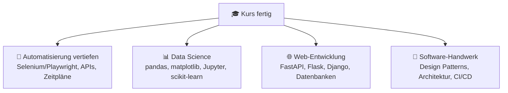

# 🔗 Kostenlose Ressourcen — kuratiert & bewertet

> Alles hier ist **komplett kostenlos**. Keine Trials, keine Paywall für die Kerninhalte.
> ⭐ = besonders empfehlenswert · 🇩🇪 = auf Deutsch verfügbar

---

## 🚨 Zuerst: Die Ressourcen-Falle

Es gibt tausende Python-Kurse. Du brauchst **nicht mehr Ressourcen — du brauchst mehr Übung.**

> 🧠 **Regel:** Maximal **eine** Zusatzressource gleichzeitig. Erst durchziehen, dann die nächste.
> Zwischen fünf Kursen zu springen ist die beliebteste Art, sechs Monate zu verlieren, ohne etwas zu können.

---

## 📖 1. Nachschlagen & Referenz

| Ressource | Wofür | Bewertung |
|---|---|---|
| ⭐ [**Python-Doku (offiziell)**](https://docs.python.org/3/) | Die Wahrheit. Anfangs sperrig, ab Modul 12 dein bester Freund | Referenz |
| ⭐ [**Python Tutorial (offiziell)**](https://docs.python.org/3/tutorial/) | Systematische Einführung von den Machern | Anfänger+ |
| [Python Standard Library](https://docs.python.org/3/library/) | Was Python alles schon mitbringt (viel!) | Referenz |
| 🇩🇪 [**Das Python-Tutorial (deutsch)**](https://py-tutorial-de.readthedocs.io/) | Deutsche Übersetzung des offiziellen Tutorials | Anfänger |
| [PEP 8 — Style Guide](https://peps.python.org/pep-0008/) | Wie man Python „richtig" schreibt (Modul 19) | Ab Mitte |

---

## 🎓 2. Vollständige Kurse (falls du eine zweite Stimme willst)

| Ressource | Format | Warum gut |
|---|---|---|
| ⭐ [**Automate the Boring Stuff with Python**](https://automatetheboringstuff.com/) | Buch, online gratis | **Die** Bibel der Alltagsautomatisierung — perfekt zu deinem Ziel 🤖 |
| ⭐ [**CS50P — Harvard**](https://cs50.harvard.edu/python/) | Videokurs + Aufgaben | Exzellent erklärt, fordernd, kostenlos (Zertifikat optional kostenpflichtig) |
| [**Think Python 3e**](https://allendowney.github.io/ThinkPython/) | Buch, online gratis | Denkweise statt Syntax-Auswendiglernen |
| [**Real Python**](https://realpython.com/) | Artikel-Sammlung | Viele Gratis-Artikel, sehr hohe Qualität, exzellente Erklärungen |
| [**freeCodeCamp Python**](https://www.freecodecamp.org/learn/scientific-computing-with-python/) | Interaktiv | Projektbasiert, komplett gratis |
| [**futurecoder.io**](https://futurecoder.io/) | Interaktiv im Browser | Extrem anfängerfreundlich, mit eingebautem Debugger 🐣 |
| 🇩🇪 [**Python-Kurs.eu**](https://www.python-kurs.eu/) | Deutsches Tutorial | Sehr ausführlich, gutes Nachschlagewerk auf Deutsch |
| 🇩🇪 [**HTML.de / Programmieren-lernen**](https://www.programmieren-lernen.io/python/) | Deutsches Tutorial | Kompakter Einstieg |

---

## ⌨️ 3. Üben, üben, üben (das Wichtigste!)

| Ressource | Was | Wann einsteigen |
|---|---|---|
| ⭐ [**Exercism — Python Track**](https://exercism.org/tracks/python) | 140+ Aufgaben, **kostenloses menschliches Mentoring** 🧑‍🏫 | Ab Modul 05 |
| ⭐ [**Codewars**](https://www.codewars.com/) | Gamifizierte Aufgaben („Kata"), Lösungen anderer ansehen 🥋 | Ab Modul 06 |
| [**HackerRank Python**](https://www.hackerrank.com/domains/python) | Strukturierte Aufgabenreihe | Ab Modul 05 |
| [**Advent of Code**](https://adventofcode.com/) | Jedes Jahr im Dezember, alte Jahrgänge immer spielbar 🎄 | Ab Modul 10 |
| [**Project Euler**](https://projecteuler.net/) | Mathe-lastige Knobelaufgaben | Wenn du Mathe magst |
| [**Edabit**](https://edabit.com/challenges/python3) | Sehr kleine, schnelle Aufgaben | Ab Modul 03 |
| [**CheckiO**](https://py.checkio.org/) | Aufgaben als Spiel verpackt 🎮 | Ab Modul 06 |

> 💡 **Codewars-Trick:** Nach dem Lösen **immer** die Lösungen anderer ansehen (Tab „Solutions"). Da lernst du in 5 Minuten mehr Python-Idiome als in einem ganzen Kapitel.

---

## 🔍 4. Verstehen & Visualisieren

| Ressource | Wofür |
|---|---|
| ⭐ [**Python Tutor**](https://pythontutor.com/visualize.html) | **Code Schritt für Schritt ablaufen sehen.** Bei „warum macht der das?!" → hierhin! 👀 |
| [**regex101**](https://regex101.com/) | Reguläre Ausdrücke live testen & erklärt bekommen (Modul 21) |
| [**Python Bytes / Real Python Podcast**](https://realpython.com/podcasts/rpp/) | Hören beim Spazieren 🎧 |
| [**Deutsche Fehlermeldungs-Suche**](https://stackoverflow.com/) | Fehlermeldung 1:1 googeln — meist ist Stack Overflow die erste Antwort |

---

## 🎥 5. Videos (YouTube, alles gratis)

| Kanal | Warum |
|---|---|
| ⭐ [**Corey Schafer**](https://www.youtube.com/@coreyms) | Die klarsten Python-Erklärvideos, die es gibt. Besonders OOP & Dekoratoren |
| [**mCoding**](https://www.youtube.com/@mCoding) | Kurze Videos zu „warum ist das so?" — ab Modul 12 |
| [**ArjanCodes**](https://www.youtube.com/@ArjanCodes) | Sauberer Code, Architektur, Design Patterns — ab Modul 19 |
| [**Tech With Tim**](https://www.youtube.com/@TechWithTim) | Projektbasierte Tutorials |
| 🇩🇪 [**Programmieren Starten**](https://www.youtube.com/@programmierenstarten) | Deutsche Python-Tutorials |
| 🇩🇪 [**the morpheus tutorials**](https://www.youtube.com/@TheMorpheusTutorials) | Sehr umfangreiche deutsche Informatik-Playlists |

> ⚠️ **Video-Warnung:** Videos fühlen sich produktiv an, sind aber passiv. **Regel: nach jedem Video Laptop zu und das Gezeigte selbst nachbauen.** Sonst ist es Unterhaltung, kein Lernen. 📺→⌨️

---

## 🤝 6. Community & Hilfe

| Ort | Wofür |
|---|---|
| [r/learnpython](https://www.reddit.com/r/learnpython/) | Anfängerfreundlich, sehr aktiv, dumme Fragen ausdrücklich erlaubt 💚 |
| [Python Discord](https://discord.gg/python) | Riesig, Hilfe oft in Minuten |
| [Stack Overflow](https://stackoverflow.com/questions/tagged/python) | Zum **Suchen** super. Zum Fragen: erst die Regeln lesen 😅 |
| 🇩🇪 [Python-Forum.de](https://www.python-forum.de/) | Deutschsprachige Community |

### 📝 Wie man eine gute Frage stellt

```text
1. ✅ Was willst du erreichen?           (Ziel)
2. ✅ Was hast du versucht?              (dein Code, MINIMAL gekürzt)
3. ✅ Was passiert stattdessen?          (Fehlermeldung KOMPLETT einfügen)
4. ✅ Was hast du schon ausprobiert?     (zeigt Eigenleistung)
```

❌ „Mein Code geht nicht, hilfe" → keine Antwort
✅ „Ich will X. Code: […]. Erwartet: 5, bekommen: TypeError […]. Ich habe schon Y probiert." → Antwort in Minuten

---

## 📚 7. Bücher (legal gratis online)

| Buch | Für wen |
|---|---|
| ⭐ [Automate the Boring Stuff](https://automatetheboringstuff.com/) | Anfänger mit Automatisierungs-Ziel |
| [Think Python 3e](https://allendowney.github.io/ThinkPython/) | Anfänger, die verstehen wollen *warum* |
| [Python for Everybody](https://www.py4e.com/book) | Absolute Anfänger, sehr sanft |
| [Beyond the Basic Stuff with Python](https://inventwithpython.com/beyond/) | Nach diesem Kurs — Best Practices |
| [The Hitchhiker's Guide to Python](https://docs.python-guide.org/) | Werkzeuge & Projektaufbau, ab Modul 17 |
| [Composing Programs](https://www.composingprograms.com/) | Wenn du es richtig tief willst (Berkeley) |

---

## 🧰 8. Werkzeuge, die du im Kurs kennenlernst

| Werkzeug | Modul | Wofür |
|---|---|---|
| VS Code | 00 | Dein Editor |
| Ruff | 19 | Linter + Formatter, superschnell |
| pytest | 18 | Tests schreiben |
| Git + GitHub | 20 | Versionskontrolle |
| `requests` | 22 | HTTP-Anfragen |
| BeautifulSoup | 23 | HTML auslesen |
| openpyxl / pandas | 24 | Excel & Tabellen |
| pypdf | 25 | PDFs bearbeiten |

---

## 🗺️ Wie geht's nach dem Kurs weiter?



**Der ehrlichste nächste Schritt:** Such dir ein Problem, das dich nervt, und löse es mit Python. Immer wieder. Das ist, was Profis tun. 🛠️

---

📌 **Wichtig zum Schluss:** Diese Liste ist ein *Buffet*, kein *Pflichtprogramm*. Der Kurs in diesem Repo reicht völlig aus. Alles hier ist optional. 🍽️
