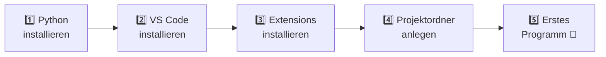

# 🔧 Setup — Python & VS Code einrichten

> ⏱️ **Dauer:** 20–30 Minuten. Einmalig. Danach nie wieder.
> 🎯 **Ziel:** Am Ende läuft `python --version` in deinem Terminal und du hast dein erstes Programm ausgeführt.

---

## 📋 Überblick



---

## 1️⃣ Python installieren

### 🪟 Windows

1. Geh auf **[python.org/downloads](https://www.python.org/downloads/)**
2. Klick auf den großen gelben Button *„Download Python 3.x.x"*
3. Starte die heruntergeladene `.exe`
4. 🚨 **GANZ WICHTIG — der häufigste Anfängerfehler überhaupt:**

```text
┌────────────────────────────────────────────────┐
│  Im Installer, GANZ UNTEN:                     │
│                                                │
│  ☑  Add python.exe to PATH   ← HAKEN SETZEN!  │
│                                                │
│  Dann erst: [ Install Now ]                    │
└────────────────────────────────────────────────┘
```

Ohne diesen Haken sagt dein Terminal später *„python wird nicht als Befehl erkannt"* — und du suchst eine Stunde nach der Ursache. 😤

5. Nach der Installation: falls ein Button *„Disable path length limit"* erscheint → **anklicken**.

<details>
<summary>🍎 <b>macOS</b></summary>

Am einfachsten über [python.org/downloads](https://www.python.org/downloads/) den `.pkg`-Installer laden und durchklicken.

Alternativ mit [Homebrew](https://brew.sh/):
```bash
brew install python
```

⚠️ macOS bringt ein altes System-Python mit. Benutze immer `python3` und `pip3`, nicht `python`/`pip`.
</details>

<details>
<summary>🐧 <b>Linux (Ubuntu/Debian)</b></summary>

```bash
sudo apt update
sudo apt install python3 python3-pip python3-venv
```
Benutze `python3` und `pip3`.
</details>

### ✅ Prüfen, ob es geklappt hat

Terminal öffnen:
- 🪟 Windows: `Win`-Taste → „PowerShell" tippen → Enter
- 🍎 macOS: `Cmd + Leertaste` → „Terminal" → Enter
- 🐧 Linux: `Strg + Alt + T`

Dann tippen:

```bash
python --version
```

**Erwartete Ausgabe:** `Python 3.12.x` (oder höher — Hauptsache die erste Zahl ist eine **3**)

<details>
<summary>❌ <b>Fehler: „python wird nicht als Befehl erkannt"</b></summary>

Drei Möglichkeiten:

1. Probier `python3 --version` statt `python`
2. **Terminal komplett schließen und neu öffnen** (PATH wird erst dann neu geladen) — das löst es in 60 % der Fälle
3. Du hast den PATH-Haken vergessen → Installer nochmal starten → *„Modify"* → *„Add to PATH"* aktivieren
</details>

---

## 2️⃣ VS Code installieren

Download: **[code.visualstudio.com](https://code.visualstudio.com/)** → installieren → durchklicken.

> 🪟 **Windows-Tipp:** Setz beim Installieren den Haken bei *„Open with Code" zum Kontextmenü hinzufügen*. Dann kannst du jeden Ordner per Rechtsklick in VS Code öffnen. Spart täglich Zeit.

---

## 3️⃣ Die richtigen Extensions

In VS Code links auf das **Extensions**-Symbol klicken (die vier Klötzchen 🧩) oder `Strg + Shift + X`.

### 🔴 Pflicht

| Extension | Herausgeber | Was sie tut |
|---|---|---|
| **Python** | Microsoft | Das Fundament: Ausführen, Debuggen, IntelliSense |
| **Pylance** | Microsoft | Blitzschnelle Autovervollständigung & Fehlerprüfung (kommt meist automatisch mit) |

### 🟡 Sehr empfohlen

| Extension | Was sie tut |
|---|---|
| **Ruff** (Astral Software) | Findet Fehler & formatiert deinen Code automatisch schön 🧼 |
| **German Language Pack** | VS Code auf Deutsch (falls dir das lieber ist) |
| **indent-rainbow** | Färbt Einrückungen ein — **Gold wert** für Python-Anfänger! 🌈 |
| **Error Lens** | Zeigt Fehler direkt in der Zeile statt nur unten 👀 |

> 💡 **indent-rainbow** ernsthaft installieren. In Python bestimmt die Einrückung die Programmlogik. Wenn du sie farbig siehst, sparst du dir gefühlt hundert `IndentationError`. 🌈

---

## 4️⃣ Deinen Arbeitsordner einrichten

Leg irgendwo einen Ordner an, z. B.:

```text
🪟 C:\Users\DEINNAME\Documents\python-kurs\
🍎 /Users/deinname/Documents/python-kurs/
```

Dann: VS Code → **Datei → Ordner öffnen…** → diesen Ordner wählen.

> ⚠️ **Wichtig:** Öffne immer den **Ordner**, nie nur eine einzelne Datei. Sonst funktionieren Debugger und Imports nicht richtig.

### 📁 Empfohlene Struktur

```text
python-kurs/
├── python-von-0-auf-100/   ← dieses Repo
│   ├── module/
│   ├── projekte/
│   └── ...
└── meine-experimente/      ← dein Spielplatz! Hier darf alles kaputt sein 💥
```

---

## 5️⃣ Dein erstes Programm 🎉

1. In VS Code: neue Datei anlegen (`Strg + N`), speichern als **`hallo.py`**
2. Das hier reintippen (**abtippen, nicht kopieren!** ⌨️):

```python
print("Hallo Welt!")
print("Mein Name ist Anna.")
print("Und ich lerne jetzt Python. 🐍")
```

3. Ausführen: **`F5`** drücken → *„Python Datei"* wählen
   *(oder: Rechtsklick im Editor → „Python-Datei im Terminal ausführen")*

**Erwartete Ausgabe unten im Terminal:**

```text
Hallo Welt!
Mein Name ist Anna.
Und ich lerne jetzt Python. 🐍
```

🎊 **Glückwunsch — du bist jetzt Programmierer.** Ernsthaft. Der Rest sind Details.

---

## ⌨️ VS Code Shortcuts, die du ab Tag 1 brauchst

| Shortcut | Was passiert |
|---|---|
| `F5` | ▶️ Programm mit Debugger starten |
| `Strg + F5` | ▶️ Programm einfach nur ausführen (schneller) |
| `Strg + S` | 💾 Speichern (mach das ständig!) |
| `Strg + ö` | 🖥️ Terminal ein-/ausblenden |
| `Strg + /` | 💬 Zeile aus-/einkommentieren |
| `Strg + D` | 🎯 Nächstes gleiches Wort mitmarkieren (Mehrfach-Cursor!) |
| `Alt + ↑ / ↓` | ↕️ Zeile nach oben/unten schieben |
| `Shift + Alt + ↓` | 📄 Zeile duplizieren |
| `Strg + Shift + P` | 🎛️ Befehlspalette (das Schweizer Taschenmesser) |
| `F2` | ✏️ Variable überall umbenennen |
| `F9` | 🔴 Breakpoint setzen (ab Modul 09 wichtig) |

📄 Ausführlicher: [`spickzettel/vscode.md`](spickzettel/vscode.md)

---

## 🎨 Optional: VS Code hübsch & angenehm machen

`Strg + Shift + P` → *„Preferences: Open User Settings (JSON)"* → das reinkopieren:

```json
{
    "editor.fontSize": 15,
    "editor.lineHeight": 1.6,
    "editor.rulers": [88],
    "editor.renderWhitespace": "boundary",
    "editor.minimap.enabled": false,
    "files.autoSave": "afterDelay",
    "files.autoSaveDelay": 1000,
    "python.analysis.typeCheckingMode": "basic",
    "[python]": {
        "editor.formatOnSave": true,
        "editor.defaultFormatter": "charliermarsh.ruff"
    }
}
```

**Was das bewirkt:**

- 👀 Größere Schrift + mehr Zeilenabstand → weniger müde Augen nach 60 Minuten
- 📏 Linie bei 88 Zeichen → hilft dir, kurze lesbare Zeilen zu schreiben
- 💾 Auto-Speichern → nie wieder „warum ändert sich nichts?!"
- 🧼 Auto-Format beim Speichern → dein Code sieht immer professionell aus

---

## 🩺 Wenn irgendwas klemmt

<details>
<summary><b>❌ „ModuleNotFoundError: No module named 'xyz'"</b></summary>

Das Paket fehlt. Installieren mit:
```bash
pip install xyz
```
Ab Modul 17 lernst du, das sauber pro Projekt zu machen (venv).
</details>

<details>
<summary><b>❌ VS Code findet meinen Python-Interpreter nicht</b></summary>

`Strg + Shift + P` → *„Python: Select Interpreter"* → deine Python-3-Installation auswählen.
Unten rechts in der Statusleiste siehst du danach, welche Version aktiv ist.
</details>

<details>
<summary><b>❌ „IndentationError: unexpected indent"</b></summary>

Du hast Leerzeichen und Tabs gemischt. Fix:
`Strg + Shift + P` → *„Convert Indentation to Spaces"*.
Und: **immer 4 Leerzeichen** benutzen, nie Tab. (VS Code macht das automatisch richtig.)
</details>

<details>
<summary><b>❌ Umlaute werden als � oder Kästchen angezeigt</b></summary>

Encoding-Problem. Beim Öffnen von Dateien explizit UTF-8 angeben — kommt ausführlich in Modul 11.
Kurzfassung: `open("datei.txt", encoding="utf-8")`
</details>

<details>
<summary><b>❌ Das Terminal reagiert nicht mehr / Programm hängt</b></summary>

`Strg + C` drücken. Das bricht das laufende Programm ab. Dein bester Freund bei Endlosschleifen. 🔁
</details>

---

## ✅ Checkliste — bevor du zu Modul 00 gehst

- [ ] `python --version` zeigt eine 3.x an
- [ ] VS Code ist installiert
- [ ] Python-Extension installiert
- [ ] indent-rainbow installiert 🌈
- [ ] Ein Ordner ist in VS Code geöffnet (nicht nur eine Datei!)
- [ ] `hallo.py` läuft und gibt Text aus
- [ ] Ich weiß, wie ich das Terminal öffne (`Strg + ö`)

**Alles abgehakt?** 🎉

**→ Los geht's mit [Modul 00](module/00/README.md)** 🚀
