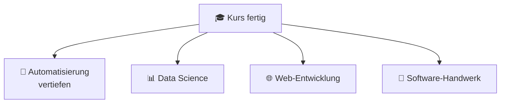

# 🚀 Wie geht es weiter?

> Du hast 27 Module, 6 Projekte und ein Capstone hinter dir.
> Was jetzt? 🤔

---

## 🎯 Die ehrlichste Antwort zuerst

**Such dir das nächste Problem und löse es.**

Kein Kurs macht dich besser als 20 selbst gebaute Werkzeuge. Ab hier lernst du durch **Bauen**, nicht durch Lernen. Alles, was folgt, ist optional — das oben ist Pflicht. 🛠️

---

## 🗺️ Die vier Wege



---

### 🤖 Weg 1 — Automatisierung vertiefen

*Passt zu dir, wenn dir Modul 24–26 am meisten Spaß gemacht haben.*

| Was | Womit |
|---|---|
| Browser steuern | `playwright`, `selenium` |
| Desktop automatisieren | `pyautogui` |
| Word/PowerPoint | `python-docx`, `python-pptx` |
| E-Mails | `imaplib`, `smtplib` |
| Zeitpläne | `schedule`, cron, Aufgabenplanung |
| Kleine Oberflächen | `tkinter`, `PySimpleGUI` |

📚 Buch: [Automate the Boring Stuff](https://automatetheboringstuff.com/) (gratis)

---

### 📊 Weg 2 — Data Science

*Passt zu dir, wenn du gerne Zahlen auswertest.*

```text
1. pandas          Daten laden, filtern, gruppieren   ⭐ Start hier
2. matplotlib      Diagramme
3. seaborn         schönere Diagramme
4. Jupyter         interaktives Arbeiten
5. numpy           schnelles Rechnen
6. scikit-learn    Machine Learning (danach)
```

📚 [Python Data Science Handbook](https://jakevdp.github.io/PythonDataScienceHandbook/) (gratis)
📚 [Kaggle Learn](https://www.kaggle.com/learn) — kurze, praktische Kurse

---

### 🌐 Weg 3 — Web-Entwicklung

*Passt zu dir, wenn du etwas bauen willst, das andere im Browser benutzen.*

| Framework | Wofür |
|---|---|
| **FastAPI** ⭐ | moderne APIs, sehr angenehm |
| **Flask** | kleine Webseiten, viel Kontrolle |
| **Django** | große Anwendungen, „alles dabei" |
| **Streamlit** | Datendashboards in Minuten |

Dazu: HTML/CSS-Grundlagen, SQL, SQLite/PostgreSQL

📚 [FastAPI-Tutorial](https://fastapi.tiangolo.com/tutorial/) · [Flask Mega-Tutorial](https://blog.miguelgrinberg.com/post/the-flask-mega-tutorial-part-i-hello-world)

---

### 🧪 Weg 4 — Software-Handwerk

*Passt zu dir, wenn du besser werden willst, nicht breiter.*

```text
• Design Patterns          ArjanCodes auf YouTube
• Clean Architecture       "Clean Code" (Robert C. Martin)
• Fortgeschrittenes Python "Fluent Python" (Luciano Ramalho) ⭐
• Nebenläufigkeit          asyncio, threading, multiprocessing
• CI/CD                    GitHub Actions
• Docker                   Anwendungen paketieren
• Typprüfung               mypy
```

📺 [ArjanCodes](https://www.youtube.com/@ArjanCodes) · [mCoding](https://www.youtube.com/@mCoding)

---

## 🏋️ Dranbleiben ohne Kurs

Das Schwierigste nach einem Kurs ist die fehlende Struktur. Diese vier Gewohnheiten ersetzen sie:

| Gewohnheit | Wie oft |
|---|---|
| 🧩 **Eine Kata lösen** ([Codewars](https://www.codewars.com/), [Exercism](https://exercism.org/tracks/python)) | 3× pro Woche, je 20 Min |
| 🛠️ **Ein Mini-Werkzeug bauen** | 1× pro Monat |
| 📖 **Fremden Code lesen** (kleine GitHub-Projekte) | 1× pro Woche |
| ✍️ **Erklären, was du gelernt hast** (Journal, Blog, Freunden) | 1× pro Woche |

🎄 Und im Dezember: [Advent of Code](https://adventofcode.com/) — 25 Tage Knobelaufgaben, macht süchtig.

---

## 🚧 Die drei Fallen nach dem Kurs

| Falle | Symptom | Ausweg |
|---|---|---|
| 📺 **Tutorial-Rückfall** | Du schaust wieder Kurse statt zu bauen | Ein Projekt starten, **bevor** du den nächsten Kurs beginnst |
| 🐿️ **Framework-Hopping** | Jede Woche eine neue Technologie | **Eine** Sache 3 Monate durchziehen |
| 💎 **Perfektionismus** | Nichts wird veröffentlicht | „Fertig und hässlich" schlägt „perfekt und ungebaut" |

---

## 📏 Woran du merkst, dass du besser wirst

Nicht am Wissen — an diesen Anzeichen:

```text
✅ Du liest Fehlermeldungen, statt zu erschrecken
✅ Du weißt, wonach du suchen musst (halbe Miete!)
✅ Du liest fremden Code und verstehst die Struktur
✅ Du erkennst, wann eine Lösung schlecht ist - auch deine eigene
✅ Du kannst schätzen, wie lange etwas dauert
✅ Du löschst Code, weil er nicht gebraucht wird
✅ Du schreibst Tests, ohne dass jemand es verlangt
✅ Alter Code von dir sieht schlecht aus  ← das ist ein GUTES Zeichen! 📈
```

---

## 🎁 Zum Schluss

Du hast ein halbes Jahr durchgehalten. Das schaffen die wenigsten.

Was du wirklich gelernt hast, ist nicht Python. Es ist:
**Ein Problem zerlegen. Dranbleiben, wenn es klemmt. Systematisch Fehler finden. Sich selbst etwas beibringen.**

Diese Fähigkeiten funktionieren in jeder Sprache — und weit über das Programmieren hinaus. 🌱

---

<div align="center">

**🐍 Viel Erfolg!**

*„Der beste Zeitpunkt, mit Programmieren anzufangen, war vor zehn Jahren.
Der zweitbeste ist heute."*

</div>
