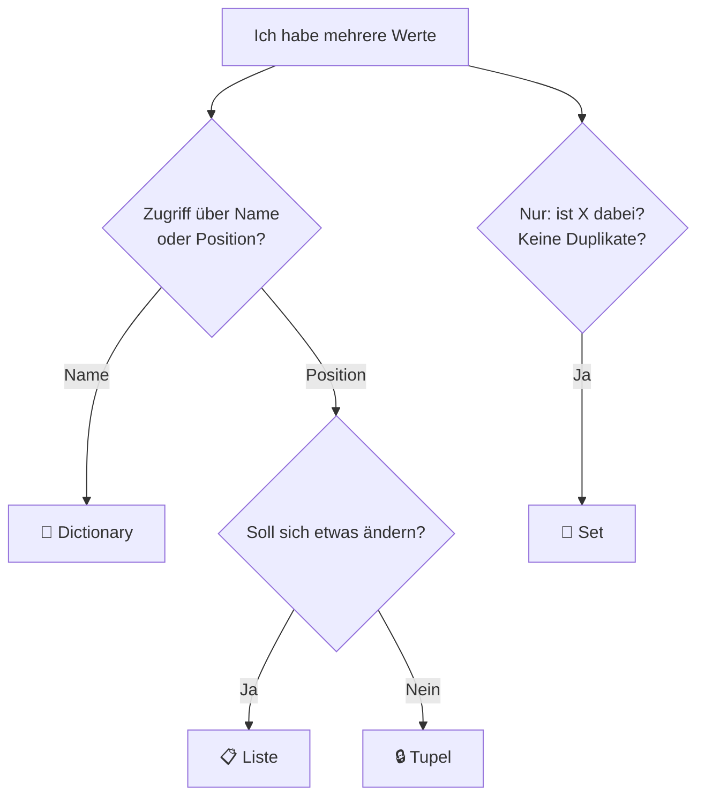

# 🗃️ Modul 07 — Dictionaries, Tupel & Sets

> ⏱️ ~5 Stunden · ⬅️ [Modul 06](../06/README.md) · ➡️ [Modul 08](../08/README.md)

---

## 🎯 Lernziele

- [ ] Dictionaries erstellen und benutzen (Schlüssel → Wert)
- [ ] sicher zugreifen mit `.get()`
- [ ] über Dictionaries iterieren mit `.items()`
- [ ] verschachtelte Strukturen lesen
- [ ] Tupel und Sets kennen und wissen, **wann** man sie nimmt

---

## 🌍 Warum das wichtig ist

Listen sind nummeriert — aber echte Daten haben **Namen**, keine Nummern.

```python
# 😰 Mit Liste: was war nochmal Index 3?
person = ["Anna", 30, "Berlin", "anna@mail.de"]

# 😍 Mit Dictionary: selbsterklärend
person = {"name": "Anna", "alter": 30, "stadt": "Berlin"}
```

**Jede API-Antwort, jede JSON-Datei, jede Konfiguration** ist ein Dictionary. Das hier ist eines der wichtigsten Module des ganzen Kurses.

---

## 📖 Die Lektion

### 1. Dictionaries — Nachschlagen per Name 📖

🏠 **Alltagsbild:** Ein **Wörterbuch**. Du schlägst nicht Seite 47 nach, sondern das Wort „Haus".

```python
person = {
    "name": "Anna",
    "alter": 30,
    "stadt": "Berlin",
}
```

```text
{ "name"  :  "Anna" }
    ▲          ▲
 Schlüssel   Wert
  (key)     (value)
```

**Regeln:** Schlüssel müssen **unveränderlich** sein (meist Strings) und sind **eindeutig**.

### 2. Zugreifen — und der sichere Weg

```python
person["name"]              # 'Anna'
person["telefon"]           # ❌ KeyError!

person.get("telefon")             # None       ✅ kein Absturz
person.get("telefon", "unbek.")   # 'unbek.'   ✅ mit Standardwert
```

> 🧠 **Tutor sagt:** Bei Daten von außen (API, Datei, Nutzer) **immer `.get()`** benutzen. Nichts nervt mehr, als wenn ein Skript nach 8 Minuten Laufzeit an einem fehlenden Feld abstürzt. 🛡️

### 3. Ändern & Hinzufügen

```python
person["alter"] = 31                    # ändern
person["telefon"] = "0123"              # hinzufügen (existiert nicht → neu)
person.update({"job": "Dev", "alter": 32})

del person["telefon"]
wert = person.pop("stadt", None)        # entfernen + zurückgeben
"name" in person                        # True  ← prüft SCHLÜSSEL
len(person)
```

### 4. ⭐ Durchlaufen

```python
for schluessel in person:               # nur Schlüssel
    print(schluessel)

for wert in person.values():            # nur Werte
    print(wert)

for k, v in person.items():             # ⭐ beides - so gut wie immer!
    print(f"{k}: {v}")
```

### 5. 🌍 Realbeispiel: Zählen mit Dictionary

Das häufigste Muster überhaupt:

```python
satz = "hallo welt"
haeufigkeit = {}

for zeichen in satz:
    if zeichen in haeufigkeit:
        haeufigkeit[zeichen] += 1
    else:
        haeufigkeit[zeichen] = 1

# eleganter mit get:
for zeichen in satz:
    haeufigkeit[zeichen] = haeufigkeit.get(zeichen, 0) + 1
```

### 6. Verschachtelte Strukturen 🪆

So sehen echte API-Daten aus:

```python
mitarbeiter = {
    "anna": {
        "alter": 30,
        "skills": ["Python", "SQL"],
        "adresse": {"stadt": "Berlin", "plz": "10115"},
    },
    "bernd": {
        "alter": 25,
        "skills": ["JavaScript"],
        "adresse": {"stadt": "Hamburg", "plz": "20095"},
    },
}

mitarbeiter["anna"]["skills"][0]              # 'Python'
mitarbeiter["anna"]["adresse"]["stadt"]       # 'Berlin'

for name, daten in mitarbeiter.items():
    print(f"{name}: {daten['alter']} Jahre, {len(daten['skills'])} Skills")
```

💡 **Lesehilfe:** Von links nach rechts arbeiten. `mitarbeiter["anna"]` → ein Dict. Davon `["skills"]` → eine Liste. Davon `[0]` → ein String.

### 7. Tupel — die unveränderliche Liste 🔒

```python
punkt = (3, 5)
farbe = (255, 128, 0)
punkt[0]          # 3
punkt[0] = 9      # ❌ TypeError
einzel = (1,)     # ⚠️ Komma nötig, sonst ist es nur eine Zahl!
```

**Wann Tupel statt Liste?**

| Nimm Tupel, wenn … | Beispiel |
|---|---|
| die Daten fest zusammengehören | Koordinaten `(x, y)` |
| sich nichts ändern soll | RGB-Farbe |
| du sie als Dict-Schlüssel brauchst | `{(0,0): "Start"}` |

⭐ **Unpacking** (funktioniert auch mit Listen):

```python
x, y = (3, 5)
name, alter, stadt = ["Anna", 30, "Berlin"]
erster, *rest = [1, 2, 3, 4]        # erster=1, rest=[2,3,4]
a, b = b, a                          # tauschen
```

### 8. Sets — Mengen ohne Duplikate 🎯

```python
s = {1, 2, 3}
set([1, 1, 2, 2, 3])       # {1, 2, 3}   ← Duplikate weg!
leer = set()               # ⚠️ {} wäre ein leeres Dict!

s.add(4)
s.discard(1)               # kein Fehler, wenn nicht vorhanden
3 in s                     # ⚡ sehr schnell, auch bei Millionen Elementen
```

**Mengenoperationen:**

```python
a = {1, 2, 3}
b = {3, 4, 5}

a | b      # {1,2,3,4,5}   Vereinigung
a & b      # {3}           Schnittmenge
a - b      # {1,2}         nur in a
a ^ b      # {1,2,4,5}     nur in einem von beiden
```

🌍 **Typische Einsätze:** Duplikate entfernen · „welche Dateien sind in A, aber nicht in B?" · schnelle „ist drin?"-Prüfung

### 9. 🧭 Entscheidungshilfe



---

## ⚠️ Typische Anfängerfehler

| Fehler | Problem | Fix |
|---|---|---|
| `d["fehlt"]` | `KeyError` | `d.get("fehlt", standard)` |
| `{}` als leeres Set | ist ein Dict! | `set()` |
| `(1)` als Tupel | ist nur die Zahl 1 | `(1,)` |
| `wert in dict` | prüft **Schlüssel**, nicht Werte | `wert in dict.values()` |
| Dict beim Iterieren ändern | `RuntimeError` | über `list(d.keys())` iterieren |

---

## ⌨️ Übungen

👉 [`aufgaben/aufgaben.py`](aufgaben/aufgaben.py) — 10 Aufgaben inkl. 🥗 Mix

---

## 🛠️ Mini-Projekt: Vokabeltrainer

`vokabeln.py` mit einem Dictionary `{"Haus": "house", ...}`:

- zeigt zufällige Vokabeln (`import random`, `random.choice(list(d.keys()))`)
- fragt ab, prüft die Antwort
- zählt richtige/falsche Antworten in einem zweiten Dict
- zeigt am Ende eine Statistik + die 3 schwierigsten Vokabeln

---

## 🧠 Selbsttest

1. Was ist der Unterschied zwischen Liste und Dictionary?
2. Warum `.get()` statt `[]`?
3. Wie durchläufst du Schlüssel und Werte gleichzeitig?
4. Wie zählst du Vorkommen mit einem Dict?
5. Wann Tupel statt Liste?
6. Warum ist `(1)` kein Tupel?
7. Wie erzeugst du ein leeres Set?
8. Wie entfernst du Duplikate aus einer Liste?
9. Was macht `a & b` bei Sets?
10. ✍️ Erkläre ein verschachteltes Dict an einem Alltagsbeispiel.

<details>
<summary>💡 Antworten</summary>

1. Liste: Zugriff über **Position**. Dict: Zugriff über **Schlüssel/Namen**.
2. `.get()` stürzt bei fehlendem Schlüssel nicht ab, sondern gibt `None` oder einen Standardwert zurück.
3. `for k, v in d.items():`
4. `d[x] = d.get(x, 0) + 1`
5. Wenn die Werte fest zusammengehören und sich nicht ändern sollen (Koordinaten, Farben, Rückgabe mehrerer Werte).
6. Die Klammern gelten hier als normale Rechenklammern. Ein Tupel braucht das Komma: `(1,)`.
7. `set()` — `{}` ist ein leeres Dictionary.
8. `list(set(liste))` (Reihenfolge geht verloren) oder mit `if x not in neue`.
9. Die Schnittmenge — alles, was in **beiden** Sets vorkommt.
10. Z. B.: „Ein Adressbuch: außen die Namen, und zu jedem Namen wieder ein Eintrag mit Telefon, Adresse und Geburtstag."
</details>

---

## 🔄 Wiederholung (Modul 04–06)

1. Was ist der Unterschied zwischen `sort()` und `sorted()`?
2. Warum ändert `b = a` bei Listen auch `a`?
3. Was macht `break`?
4. Wie prüfst du, ob ein Jahr durch 4 teilbar ist?

---

## 🔗 Vertiefung

- 📖 [Real Python — Dictionaries](https://realpython.com/python-dicts/)
- 📄 [Spickzettel Listen & Dicts](../../spickzettel/listen-dicts.md)

**➡️ [Modul 08 — Funktionen](../08/README.md)** ⚙️
