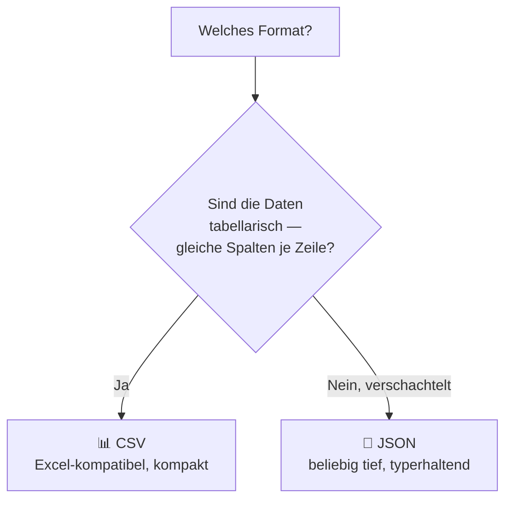

# 🔗 Modul 16 — CSV & JSON

> ⏱️ ~5 Stunden · ⬅️ [Modul 15](../15/README.md) · ➡️ [Modul 17](../17/README.md)

---

## 🎯 Lernziele

- [ ] CSV-Dateien lesen und schreiben (auch mit `DictReader`)
- [ ] JSON laden und speichern
- [ ] verschachtelte JSON-Strukturen navigieren
- [ ] wissen, wann CSV und wann JSON
- [ ] deutsche CSV-Eigenheiten (Semikolon, Komma als Dezimaltrenner) 🇩🇪

---

## 🌍 Warum das wichtig ist

Das sind **die zwei Datenformate**, die dir überall begegnen:

| Format | Wo du es triffst |
|---|---|
| 📊 **CSV** | Excel-Exporte, Kontoauszüge, Umfragedaten, Berichte |
| 🔗 **JSON** | APIs (Modul 22), Konfigurationsdateien, moderne Datenspeicher |

Wer diese beiden beherrscht, kann mit fast jeder Datenquelle arbeiten.

---

## 📖 Die Lektion

### 1. CSV — die Grundform

```text
name;alter;stadt          ← Kopfzeile
Anna;30;Berlin
Bernd;25;Hamburg
```

⚠️ Nicht per Hand mit `split(",")` parsen! Das geht schief, sobald ein Feld selbst ein Komma enthält (`"Müller, Anna"`). Nimm das `csv`-Modul.

### 2. CSV lesen

```python
import csv

with open("daten.csv", encoding="utf-8", newline="") as f:
    leser = csv.reader(f, delimiter=";")
    kopf = next(leser)                    # erste Zeile = Spaltennamen
    for zeile in leser:
        print(zeile)                      # ['Anna', '30', 'Berlin']
```

⭐ **Besser: `DictReader`** — Zugriff über Spaltennamen:

```python
with open("daten.csv", encoding="utf-8", newline="") as f:
    for zeile in csv.DictReader(f, delimiter=";"):
        print(zeile["name"], zeile["stadt"])     # viel lesbarer!
```

💡 **Immer `newline=""`** beim Öffnen von CSV — sonst gibt es unter Windows Leerzeilen.

### 3. CSV schreiben

```python
with open("aus.csv", "w", encoding="utf-8", newline="") as f:
    schreiber = csv.writer(f, delimiter=";")
    schreiber.writerow(["name", "alter"])
    schreiber.writerows([["Anna", 30], ["Bernd", 25]])

# Mit Dictionaries:
with open("aus.csv", "w", encoding="utf-8", newline="") as f:
    schreiber = csv.DictWriter(f, fieldnames=["name", "alter"], delimiter=";")
    schreiber.writeheader()
    schreiber.writerows([{"name": "Anna", "alter": 30}])
```

### 4. 🇩🇪 Deutsche CSV-Fallen

| Falle | Problem | Lösung |
|---|---|---|
| Trennzeichen | Deutsches Excel nutzt `;` statt `,` | `delimiter=";"` |
| Dezimaltrenner | `1234,56` statt `1234.56` | `.replace(",", ".")` vor `float()` |
| Encoding | Excel schreibt oft `cp1252` | `encoding="utf-8-sig"` probieren |
| Alles ist Text | `"30"` statt `30` | selbst umwandeln! |

```python
def zu_zahl(text):
    """Wandelt '1.234,56' in 1234.56 um."""
    return float(text.replace(".", "").replace(",", "."))
```

### 5. JSON — verschachtelte Daten

```python
import json

daten = {
    "name": "Anna",
    "alter": 30,
    "skills": ["Python", "SQL"],
    "adresse": {"stadt": "Berlin", "plz": "10115"},
}

# Speichern
with open("daten.json", "w", encoding="utf-8") as f:
    json.dump(daten, f, indent=2, ensure_ascii=False)   # ⭐ beide Optionen!

# Laden
with open("daten.json", encoding="utf-8") as f:
    geladen = json.load(f)

print(geladen["adresse"]["stadt"])       # Berlin
```

| Option | Wirkung |
|---|---|
| `indent=2` | lesbar formatiert statt einer langen Zeile |
| `ensure_ascii=False` | ⭐ Umlaute bleiben Umlaute statt `ä` |

**Mit Strings statt Dateien:**

```python
text = json.dumps(daten)     # Objekt → String
objekt = json.loads(text)    # String → Objekt   ⭐ das brauchst du bei APIs
```

### 6. Typ-Zuordnung

| Python | JSON |
|---|---|
| `dict` | object |
| `list`, `tuple` | array |
| `str` | string |
| `int`, `float` | number |
| `True` / `False` | `true` / `false` |
| `None` | `null` |

⚠️ **Nicht JSON-fähig:** `set`, `datetime`, eigene Objekte → vorher umwandeln (z. B. `list(mein_set)`, `datum.isoformat()`).

### 7. 🤔 CSV oder JSON?



---

## ⚠️ Typische Anfängerfehler

| Fehler | Problem | Fix |
|---|---|---|
| CSV mit `split(",")` | bricht bei Kommas im Feld | `csv`-Modul |
| `newline=""` vergessen | Leerzeilen unter Windows | immer angeben |
| `ensure_ascii` vergessen | `ä` statt `ä` | `ensure_ascii=False` |
| CSV-Werte als Zahlen erwartet | alles ist `str` | `int()`/`float()` |
| `json.dump` vs. `dumps` | verwechselt | `dump`=Datei, `dumps`=String |

---

## ⌨️ Übungen

👉 [`aufgaben/aufgaben.py`](aufgaben/aufgaben.py) — legt eigene Testdateien an

---

## 🛠️ Mini-Projekt: Kontoauszug-Analyse 💰

Siehe [`projekte/04_kontoauszug/`](../../projekte/04_kontoauszug/README.md) — das ist Projekt 4.

---

## 🧠 Selbsttest

1. Warum nicht `split(",")` für CSV?
2. Wozu `newline=""`?
3. Was macht `DictReader` besser?
4. Welchen Typ haben CSV-Werte immer?
5. `json.dump` vs. `json.dumps`?
6. Wozu `ensure_ascii=False`?
7. Wie navigierst du in verschachteltem JSON?
8. Welche Python-Typen kann JSON nicht?
9. Wann CSV, wann JSON?
10. ✍️ Wie wandelst du `"1.234,56"` in eine Zahl?

<details>
<summary>💡 Antworten</summary>

1. Felder können selbst Kommas enthalten (in Anführungszeichen) — `split` zerlegt sie falsch.
2. Verhindert zusätzliche Leerzeilen beim Schreiben unter Windows.
3. Zugriff über Spaltennamen statt über Indizes — viel lesbarer und robuster.
4. Immer `str`.
5. `dump` schreibt in eine Datei, `dumps` gibt einen String zurück.
6. Damit Umlaute lesbar bleiben statt als `ä` gespeichert zu werden.
7. Mit verketteten Schlüsseln/Indizes: `d["a"]["b"][0]`.
8. `set`, `datetime`, eigene Objekte.
9. CSV für flache Tabellen, JSON für verschachtelte Strukturen.
10. `float(text.replace(".", "").replace(",", "."))`
</details>

---

## 🔄 Wiederholung (Modul 13–15)

1. Warum `except: pass` vermeiden?
2. Was macht `super()`?
3. Was schenkt dir `@dataclass`?
4. Merksatz Vererbung vs. Komposition?

---

## 🔗 Vertiefung

- 📖 [Real Python — CSV](https://realpython.com/python-csv/) · [JSON](https://realpython.com/python-json/)

**➡️ [Modul 17 — venv, pip & Projektstruktur](../17/README.md)** 📦
