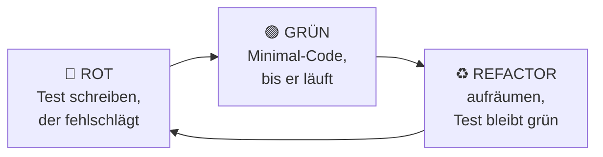

# ✅ Modul 18 — Tests mit pytest

> ⏱️ ~5 Stunden · ⬅️ [Modul 17](../17/README.md) · ➡️ [Modul 19](../19/README.md)

---

## 🎯 Lernziele

- [ ] verstehen, **warum** man testet
- [ ] Tests mit `pytest` schreiben und ausführen
- [ ] gute Testfälle finden (inkl. Randfälle)
- [ ] Exceptions testen mit `pytest.raises`
- [ ] mit `@parametrize` viele Fälle kompakt prüfen

---

## 🌍 Warum das wichtig ist

Jeder testet — die Frage ist nur, **wie**.

```text
❌ Manuell:  Code ändern → Programm starten → hoffen → Ausgabe angucken
             ...bei jeder Änderung. Wieder. Und wieder.

✅ Mit Tests: Code ändern → pytest → grün oder rot in 0,3 Sekunden ⚡
```

Der eigentliche Gewinn ist **Angstfreiheit**: Mit Tests traust du dich, Code umzubauen. Ohne Tests wird jede Änderung zum Risiko — und dein Projekt versteinert.

> 🧠 **Tutor sagt:** Tests fühlen sich anfangs nach „doppelter Arbeit" an. Der Moment, in dem es klickt, kommt, wenn ein Test einen Fehler findet, den du nie bemerkt hättest. Dann willst du sie nicht mehr missen. 🎯

---

## 📖 Die Lektion

### 1. Installation & erster Test

```bash
pip install pytest
```

```python
# rechner.py
def addiere(a, b):
    return a + b
```

```python
# test_rechner.py
from rechner import addiere

def test_addiere_positive_zahlen():
    assert addiere(2, 3) == 5

def test_addiere_negative_zahlen():
    assert addiere(-1, -1) == -2
```

```bash
pytest              # findet und startet alle Tests automatisch
pytest -v           # ausführlich, zeigt jeden Testnamen
pytest -x           # stoppt beim ersten Fehler
```

```text
test_rechner.py::test_addiere_positive_zahlen PASSED  [ 50%]
test_rechner.py::test_addiere_negative_zahlen PASSED  [100%]

======================== 2 passed in 0.01s =========================
```

### 2. Die Regeln, damit pytest deine Tests findet

```text
📄 Datei    →  test_*.py  oder  *_test.py
🔧 Funktion →  test_*
📁 Ordner   →  tests/  (Konvention)
```

### 3. `assert` — mehr braucht es nicht

```python
assert ergebnis == 5
assert ergebnis != 0
assert ergebnis > 0
assert "python" in text.lower()
assert isinstance(x, list)
assert len(liste) == 3
assert not liste                       # leer?
assert abs(0.1 + 0.2 - 0.3) < 1e-9     # Floats nie direkt vergleichen!
```

💡 pytest zeigt bei Fehlschlag automatisch die **tatsächlichen Werte** — du musst nichts extra ausgeben.

### 4. ⭐ Gute Testfälle finden

Das ist die eigentliche Fähigkeit. Für jede Funktion durchgehen:

```text
✅ Normalfall        addiere(2, 3) == 5
🔲 Randfall          addiere(0, 0), leere Liste, ein Element
🔻 Grenzwert         genau an der Bedingung: >= 18 → teste 17, 18, 19
💥 Fehlerfall        falscher Typ, negative Werte, None
🌍 Realer Fall       ein echtes Beispiel aus deiner Anwendung
```

```python
def test_durchschnitt_normalfall():
    assert durchschnitt([2, 4, 6]) == 4

def test_durchschnitt_ein_element():
    assert durchschnitt([5]) == 5

def test_durchschnitt_leere_liste():
    assert durchschnitt([]) == 0        # was SOLL passieren? Definiere es!

def test_durchschnitt_negative():
    assert durchschnitt([-2, 2]) == 0
```

### 5. Exceptions testen

```python
import pytest

def test_wirft_bei_leerer_liste():
    with pytest.raises(ValueError):
        durchschnitt([])

def test_fehlermeldung_stimmt():
    with pytest.raises(ValueError, match="darf nicht leer"):
        durchschnitt([])
```

### 6. ⭐ `@parametrize` — viele Fälle, ein Test

```python
import pytest

@pytest.mark.parametrize("a, b, erwartet", [
    (2, 3, 5),
    (0, 0, 0),
    (-1, 1, 0),
    (100, 200, 300),
])
def test_addiere(a, b, erwartet):
    assert addiere(a, b) == erwartet
```

→ pytest macht daraus **4 eigenständige Tests**. Sehr elegant.

### 7. Fixtures — Testdaten bereitstellen

```python
import pytest

@pytest.fixture
def beispiel_konto():
    """Liefert ein frisches Konto für jeden Test."""
    return Konto("Testperson", 1000)

def test_einzahlen(beispiel_konto):
    beispiel_konto.einzahlen(500)
    assert beispiel_konto.stand == 1500
```

Jeder Test bekommt ein **frisches** Objekt — Tests beeinflussen sich nie gegenseitig.

### 8. 🔴🟢♻️ TDD in drei Schritten



Musst du nicht immer machen — aber einmal ausprobieren lohnt sich sehr.

### 9. Was man testet — und was nicht

| ✅ Testen | ❌ Nicht testen |
|---|---|
| eigene Logik & Berechnungen | Python selbst (`len()` funktioniert) |
| Randfälle & Grenzwerte | fremde Bibliotheken |
| gefundene Bugs (Regressionstest!) | reine `print`-Ausgaben |
| Datenumwandlungen | triviale Getter |

> 💡 **Bug gefunden?** Schreib **zuerst** einen Test, der ihn reproduziert. Dann repariere. So kommt derselbe Fehler nie wieder zurück. 🛡️

---

## ⚠️ Typische Anfängerfehler

| Fehler | Problem | Fix |
|---|---|---|
| Datei nicht `test_*.py` | pytest findet nichts | umbenennen |
| Tests hängen voneinander ab | zufällige Fehlschläge | Fixtures nutzen |
| Floats mit `==` | schlägt fehl | `abs(a-b) < 1e-9` |
| nur Normalfälle | Bugs bleiben | Randfälle! |
| Test testet zu viel | unklar, was kaputt ist | ein Test = eine Sache |

---

## ⌨️ Übungen

👉 [`aufgaben/`](aufgaben/) — enthält `funktionen.py` (teils fehlerhaft!) und `test_funktionen.py`

---

## 🛠️ Mini-Projekt: Tests für dein Werkzeugmodul

Nimm `werkzeuge.py` aus Modul 12 und schreib eine komplette Testdatei:

- [ ] mindestens 3 Tests pro Funktion (Normal-, Rand-, Fehlerfall)
- [ ] mindestens 1× `@parametrize`
- [ ] mindestens 1× `pytest.raises`
- [ ] mindestens 1 Fixture
- [ ] `pytest -v` läuft komplett grün ✅

**Bonus 🎁:** `pip install pytest-cov` und `pytest --cov=werkzeuge` — wie viel Prozent deines Codes decken die Tests ab?

---

## 🧠 Selbsttest

1. Warum automatisiert testen statt manuell?
2. Wie muss eine Testdatei heißen?
3. Wie muss eine Testfunktion heißen?
4. Welche fünf Fallarten solltest du abdecken?
5. Wie testest du, dass ein Fehler geworfen wird?
6. Was macht `@parametrize`?
7. Wozu Fixtures?
8. Was sind die drei TDD-Schritte?
9. Warum Floats nicht mit `==` testen?
10. ✍️ Was tust du als Erstes, wenn du einen Bug findest?

<details>
<summary>💡 Antworten</summary>

1. Automatisierte Tests laufen in Sekunden, immer gleich, und prüfen auch alte Funktionen mit.
2. `test_*.py` oder `*_test.py`
3. `test_*`
4. Normalfall, Randfall, Grenzwert, Fehlerfall, realer Fall.
5. `with pytest.raises(ValueError):`
6. Erzeugt aus einer Testfunktion mehrere Tests mit verschiedenen Eingabewerten.
7. Sie liefern jedem Test frische, unabhängige Testdaten.
8. Rot (Test schlägt fehl) → Grün (minimal reparieren) → Refactor.
9. Wegen der binären Rundung — `0.1 + 0.2 != 0.3`.
10. Einen Test schreiben, der den Bug reproduziert — dann reparieren.
</details>

---

## 🔄 Wiederholung (Modul 15–17)

1. Was schenkt dir `@dataclass`?
2. Wozu `requirements.txt`?
3. Warum `newline=""` bei CSV?
4. Wohin gehören API-Keys?

---

## 🔗 Vertiefung

- 📖 [pytest Doku](https://docs.pytest.org/)
- 📖 [Real Python — Testing](https://realpython.com/pytest-python-testing/)

**➡️ [Modul 19 — Sauberer Code](../19/README.md)** 🧼
