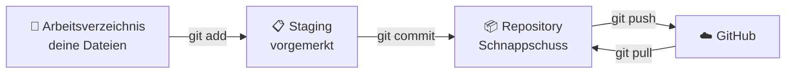

# 🌳 Modul 20 — Git & GitHub

> ⏱️ ~5 Stunden · ⬅️ [Modul 19](../19/README.md) · ➡️ [Modul 21](../21/README.md)

---

## 🎯 Lernziele

- [ ] verstehen, was Git ist und warum es unverzichtbar ist
- [ ] `init`, `add`, `commit`, `log`, `diff` sicher benutzen
- [ ] Änderungen rückgängig machen
- [ ] mit Branches arbeiten
- [ ] ein Projekt auf GitHub veröffentlichen

---

## 🌍 Warum das wichtig ist

Kennst du das? 😅

```text
projekt.py
projekt_final.py
projekt_final_v2.py
projekt_final_v2_WIRKLICH_FINAL.py
projekt_final_v2_WIRKLICH_FINAL_alt.py
```

Git löst das für immer. Es ist eine **Zeitmaschine** für deinen Code: Jeder Stand bleibt erhalten, du kannst jederzeit zurück, und du siehst genau, was sich wann geändert hat.

Und GitHub ist dein **Portfolio**. Wer später mit Programmieren zu tun hat, schaut da hin.

---

## 📖 Die Lektion

### 1. Das Modell in einem Bild



🏠 **Alltagsbild:** `add` = Sachen in den Karton legen. `commit` = Karton zukleben und beschriften. `push` = Karton ins Lager bringen.

### 2. Einmalig einrichten

```bash
git config --global user.name  "Dein Name"
git config --global user.email "deine@mail.de"
git config --global init.defaultBranch main
```

### 3. Der tägliche Ablauf

```bash
git status                       # 👀 was ist los? (benutz das STÄNDIG!)
git add datei.py                 # einzelne Datei vormerken
git add .                        # alles vormerken
git commit -m "Fügt Passwortprüfung hinzu"
git log --oneline                # Verlauf
git diff                         # was habe ich geändert?
```

> 🧠 **Tutor sagt:** `git status` ist dein wichtigster Befehl. Bei jeder Unsicherheit: `git status`. Git sagt dir sogar meistens direkt, welcher Befehl als Nächstes sinnvoll ist. 🧭

### 4. 📝 Gute Commit-Nachrichten

```text
✅ "Fügt CSV-Export hinzu"
✅ "Behebt Absturz bei leerer Eingabe"
✅ "Refactor: Auswertung in eigene Funktion"

❌ "update"        ❌ "fix"        ❌ "asdf"        ❌ "änderungen"
```

**Faustregeln:**
- Was **macht** der Commit? (nicht: was hast du getippt)
- Ein Commit = **eine** logische Änderung
- Lieber viele kleine als ein riesiger

### 5. Rückgängig machen 🔙

```bash
git restore datei.py             # Änderungen an Datei verwerfen
git restore --staged datei.py    # aus Staging nehmen (Datei bleibt geändert)
git commit --amend -m "neuer Text"   # letzten Commit-Text korrigieren
git revert <hash>                # Commit rückgängig — sicher, neuer Commit
git log --oneline                # Hash finden
```

⚠️ `git reset --hard` löscht Änderungen **unwiderruflich**. Als Anfänger: Finger weg. Nimm `git revert`.

### 6. Branches 🌿

```bash
git branch                       # alle Branches
git switch -c neue-funktion      # neuen Branch + hinwechseln
# ... arbeiten, committen ...
git switch main
git merge neue-funktion
git branch -d neue-funktion
```

```text
main       ●───●───●───────●  ← merge
                    \      /
neue-funktion        ●───●
```

🌍 **Wozu?** Du probierst etwas aus, ohne den funktionierenden Stand kaputtzumachen. Klappt es nicht: Branch löschen, nichts passiert.

### 7. ☁️ GitHub

```bash
# Repo auf github.com anlegen (Private oder Public), dann:
git remote add origin https://github.com/DEINNAME/REPO.git
git push -u origin main          # erstes Mal
git push                         # danach
git pull                         # Änderungen holen
git clone https://github.com/x/y.git    # fremdes Repo laden
```

🔐 **Private vs. Public:** Private Repos sieht nur du (und wen du einlädst). Lernrepos und alles mit persönlichen Daten → **Private**.

### 8. `.gitignore` 🚫

```gitignore
__pycache__/
*.pyc
.venv/
.env
.vscode/
.DS_Store
*.log
daten/ausgabe/
```

> 🚨 **Merksatz:** Was einmal gepusht wurde, bleibt in der History — auch nach dem Löschen. **Niemals** Passwörter, API-Keys oder `.env` committen. Prüf **vor** dem ersten Push, ob deine `.gitignore` sitzt.

### 9. Eine gute Repo-README 📄

```markdown
# Projektname

Ein Satz: was macht das Tool und für wen?

## Installation
    python -m venv .venv && .venv\Scripts\activate
    pip install -r requirements.txt

## Nutzung
    python src/haupt.py --eingabe daten/

## Features
- ...

## Lizenz
MIT
```

Das ist das Erste (und oft Einzige), was jemand von deinem Projekt sieht. 👀

---

## ⚠️ Typische Anfängerfehler

| Fehler | Problem | Fix |
|---|---|---|
| `.venv` committet | Repo wird riesig | `.gitignore` **vorher** |
| API-Key gepusht | 🚨 Sicherheitsleck | Key sofort widerrufen! |
| Commit-Nachricht „update" | History wertlos | beschreibende Texte |
| Nur ein Riesen-Commit | nichts nachvollziehbar | oft und klein committen |
| `git reset --hard` | Arbeit weg 💀 | `git revert` nutzen |

---

## ⌨️ Übungen

👉 [`aufgaben/aufgaben.md`](aufgaben/aufgaben.md) — Terminal-Übungen mit Checkliste

---

## 🛠️ Mini-Projekt: Alles auf GitHub 🚀

- [ ] Für **jedes** bisherige Projekt ein eigenes Repo (Private!)
- [ ] Jedes mit `README.md`, `.gitignore`, `requirements.txt`
- [ ] Mindestens 5 sinnvolle Commits pro Projekt
- [ ] Ein Branch mit einer neuen Funktion, gemergt
- [ ] Ein Profil-README auf GitHub (Repo mit deinem Benutzernamen)

Am Ende hast du eine sichtbare Historie deines Lernwegs. In 6 Monaten zurückzuschauen ist unbezahlbar motivierend. 📈

---

## 🧠 Selbsttest

1. Wozu Versionskontrolle?
2. Was macht `git add`, was `git commit`?
3. Was zeigt `git status`?
4. Wie machst du Änderungen an einer Datei rückgängig?
5. Warum `revert` statt `reset --hard`?
6. Wozu Branches?
7. Was gehört in `.gitignore`?
8. Was tust du, wenn du versehentlich einen API-Key gepusht hast?
9. Was macht eine gute Commit-Nachricht aus?
10. ✍️ Erkläre Git mit einem eigenen Bild.

<details>
<summary>💡 Antworten</summary>

1. Jederzeit zu früheren Ständen zurück, nachvollziehen was sich geändert hat, sicher experimentieren.
2. `add` merkt Änderungen für den nächsten Schnappschuss vor, `commit` speichert ihn dauerhaft.
3. Welche Dateien geändert, vorgemerkt oder unbekannt sind — plus Vorschläge fürs weitere Vorgehen.
4. `git restore datei.py`
5. `revert` erzeugt einen neuen Commit und ist umkehrbar; `reset --hard` löscht unwiderruflich.
6. Um Neues auszuprobieren, ohne den funktionierenden Hauptstand zu gefährden.
7. Virtuelle Umgebungen, Cache, Geheimnisse, Editor-Ordner, generierte Dateien.
8. Den Key **sofort widerrufen und neu erzeugen** — Löschen aus dem Repo reicht nicht.
9. Sie beschreibt in einem Satz, was die Änderung bewirkt.
10. Z. B.: „Git ist ein Fotoalbum meines Projekts — jeder Commit ein Foto, und ich kann jederzeit zu jedem Foto zurückspringen."
</details>

---

## 🔄 Wiederholung (Modul 17–19)

1. Wozu `requirements.txt`?
2. Wie testest du eine Exception?
3. Was ist eine magische Zahl?
4. Was macht `ruff check --fix`?

---

## 🔗 Vertiefung

- 🎮 [Learn Git Branching](https://learngitbranching.js.org/?locale=de_DE) ⭐ interaktiv, auf Deutsch — sehr zu empfehlen!
- 📖 [Pro Git Buch (deutsch, gratis)](https://git-scm.com/book/de/v2)
- 📄 [Spickzettel Git](../../spickzettel/git.md)

**➡️ [Modul 21 — Reguläre Ausdrücke](../21/README.md)** 🔍
