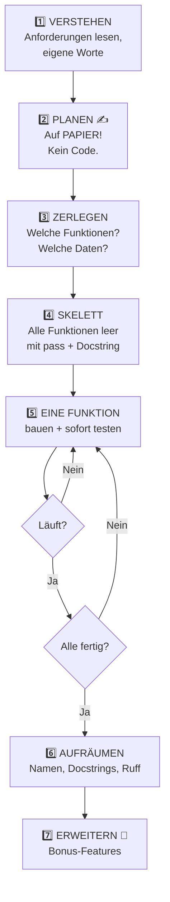

# 🏆 Die Projekte

> Module bringen dir Werkzeuge bei. **Projekte machen dich zum Entwickler.**

Beim Lösen von Übungsaufgaben ist das Problem schon zerlegt. Bei einem Projekt musst du es **selbst zerlegen** — und genau das ist die eigentliche Fähigkeit. 🧩

---

## 📋 Die 7 Projekte

| # | Projekt | Nach Modul | Du übst | Zeit |
|:---:|---|:---:|---|:---:|
| [1](01_zahlenraten/) | 🎲 **Zahlenraten-Spiel** | 05 | Schleifen, Bedingungen, Eingaben | ~4 h |
| [2](02_haushaltsbuch/) | 💰 **Haushaltsbuch (CLI)** | 08 | Listen, Dicts, Funktionen, Menü | ~5 h |
| [3](03_aufraeumer/) | 🗂️ **Ordner-Aufräumer** | 13 | pathlib, Exceptions, Trockenlauf | ~5 h |
| [4](04_kontoauszug/) | 🏦 **Kontoauszug-Analyse** | 16 | CSV, Auswertung, Berichte | ~5 h |
| [5](05_wetter/) | ⛅ **Wetter-Dashboard** | 22 | APIs, JSON, Fehlerbehandlung | ~5 h |
| [6](06_report/) | 📈 **Report-Generator** | 24 | Excel, Diagramme, Automatisierung | ~6 h |
| [🎓](capstone/) | 🏆 **Capstone** | 26 | **alles** | 20 h+ |

---

## 🧭 So gehst du ein Projekt an



> 🧠 **Tutor sagt:** Schritt 2 ist der, den alle überspringen — und genau deshalb landen sie in Schritt 5 im Chaos. **15 Minuten Papier sparen 2 Stunden Code.** ✍️

### 📝 Die Papier-Phase konkret

Bevor du eine Zeile tippst, beantworte schriftlich:

```text
1. Was soll das Programm können?      (3-5 Sätze)
2. Was gibt der Nutzer rein?
3. Was kommt raus?
4. Welche Daten muss ich speichern? Und in welcher Struktur?
5. Welche Schritte braucht es? (nummerierte Liste)
6. Welche Funktion für welchen Schritt?
7. Was kann schiefgehen? (mindestens 5 Fälle!)
```

### 🦴 Das Skelett zuerst

```python
def lade_daten(pfad):
    """Lädt die Daten aus einer Datei."""
    pass

def werte_aus(daten):
    """Berechnet die Statistiken."""
    pass

def zeige_bericht(ergebnis):
    """Gibt den Bericht formatiert aus."""
    pass

def main():
    """Hauptprogramm."""
    daten = lade_daten("daten.csv")
    ergebnis = werte_aus(daten)
    zeige_bericht(ergebnis)

if __name__ == "__main__":
    main()
```

Jetzt siehst du **die ganze Struktur** auf einen Blick — und füllst eine Funktion nach der anderen. Nach jeder: ausführen und testen. 🔁

---

## ✅ Wann ist ein Projekt „fertig"?

Nicht wenn es läuft. Sondern wenn:

- [ ] alle **Pflichtanforderungen** erfüllt sind
- [ ] es bei **falschen Eingaben nicht abstürzt**
- [ ] der Code in **sinnvolle Funktionen** zerlegt ist
- [ ] jede Funktion einen **Docstring** hat
- [ ] die Namen **verständlich** sind
- [ ] ein **Fremder** es ohne deine Hilfe starten kann
- [ ] du es jemandem **in 2 Minuten erklären** könntest

---

## 🎯 Der Härtetest: Sabotiere dein eigenes Projekt

Bevor du es als fertig ansiehst, versuch aktiv, es kaputtzumachen: 💥

```text
□ Buchstaben eingeben, wo Zahlen erwartet werden
□ Nichts eingeben, nur Enter drücken
□ Negative Zahlen, riesige Zahlen, 0
□ Datei löschen, die das Programm braucht
□ Leere Datei benutzen
□ Datei mit kaputten Daten benutzen
□ Sonderzeichen und Umlaute eingeben
□ Strg+C mittendrin drücken
```

**Jeder Absturz, den du selbst findest, ist einer weniger, der dich später ärgert.** 😄

---

## 🚫 Die drei größten Projektfehler

| Fehler | Warum schlimm | Besser |
|---|---|---|
| 🏗️ **Zu groß angefangen** | Du siehst nie einen Erfolg | Kleinste lauffähige Version zuerst, dann erweitern |
| 💎 **Perfektionismus** | Nichts wird fertig | Erst funktionierend, dann schön |
| 📋 **Lösung abgeschrieben** | Du lernst nichts | Erst selbst kämpfen, dann vergleichen |

---

## 🔍 Zu den Musterlösungen

In jedem Projektordner liegt ein Ordner `loesung/`.

> ⛔ **Bitte erst öffnen, wenn dein eigenes Projekt läuft.**
>
> Und wenn du reinschaust: **nicht kopieren.** Lies sie, schließ die Datei, und bau die Idee aus dem Kopf nach. Dieser eine Schritt ist der Unterschied zwischen „gesehen" und „gekonnt". 🧠

Deine Lösung sieht anders aus als die Musterlösung? **Sehr gut.** Es gibt nicht *die* richtige Lösung. Vergleiche stattdessen: Ist meine lesbarer? Robuster? Kürzer? Was kann ich übernehmen?

---

**Los geht's mit [Projekt 1 — Zahlenraten](01_zahlenraten/README.md)** 🎲
